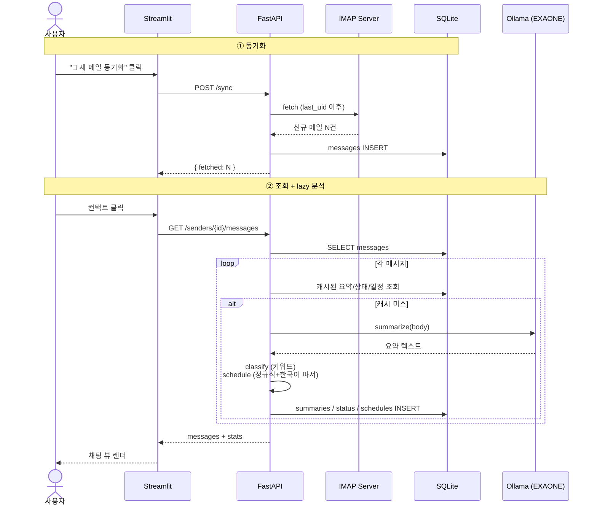

# Mail4Work

발신자/대화 단위로 메일을 재구성하고, 요약·일정·상태를 자동 분석해주는 업무 메일 기반 업무 자동화 서비스입니다.
받은편지함을 한 줄씩 훑는 대신 **누구와 무슨 얘기를 하고 있고, 무엇이 회신을 기다리는지** 한눈에 볼 수 있습니다.


## Features

### 📊 Dashboard

- 회신 필요 / 진행 중 / 이번 주 일정 / 신규 24H KPI 카드


- 회신 필요 메일 리스트 + 다가오는 일정 카드


- 컨택트별 최근 7일 활동 히트맵
- 메일 상태 분포 도넛 + 인사이트 추천


### 💬 Mail Groups


- 컨택트별 채팅 인터페이스 — 받은 메일은 좌측, 보낸 메일은 우측 정렬
- 메시지마다 자동 분류된 **상태 뱃지** (회신 필요 / 진행 중 / 완료 / 참고)
- 본문에서 추출된 **일정 카드**를 인라인으로 표시


- **AI 요약** 박스로 빠르게 핵심 파악 + 전문 보기 토글
- 사이드바: 카드형 컨택트 리스트 (아바타·제목 미리보기·시간·회신 필요 카운트)


## Stack

- **Mail**: IMAP (`imap-tools`)
- **Summarize**: EXAONE 3.5 2.4B via Ollama (로컬 LLM)
- **Schedule extract**: 정규식 + 자체 한국어 날짜 파서
- **Status classify**: 키워드 룰
- **Backend**: FastAPI
- **Frontend**: Streamlit
- **Storage**: SQLite

## Setup

```bash
python -m venv .venv
source .venv/bin/activate
pip install -r requirements.txt
cp .env.example .env  # 값 채우기
```


### Ollama (요약 모델)

요약은 로컬 Ollama로 EXAONE 3.5 2.4B를 호출합니다.

```bash
brew install ollama          # macOS
ollama serve &               # 백그라운드 데몬
ollama pull exaone3.5:2.4b   # 1.5GB 다운로드 (1회)
```

## Run

```bash
# IMAP 동기화 (UI 사이드바의 "🔄 새 메일 동기화" 버튼으로도 가능)
python -m src.mail.fetch

# 백엔드 (FastAPI, 포트 8000)
uvicorn src.api.main:app --reload

# 프론트 (Streamlit, 포트 8501)
streamlit run src/ui/mail.py
```


## API

상세 스키마는 [docs/API.md](docs/API.md) 참고.

| Method | Path | 설명 |
| --- | --- | --- |
| `POST` | `/sync` | IMAP 풀 동기화 트리거 (모든 설정 폴더) |
| `GET` | `/sync/status` | 마지막 동기화 시각 + 총 메시지 수 |
| `GET` | `/senders` | 컨택트 목록 (자기 자신 제외, 최신순) |
| `GET` | `/senders/{sender_id}/messages` | 특정 컨택트와의 메시지 + 통계 (요약·상태·일정 lazy 트리거) |
| `GET` | `/threads/{thread_id}` | 스레드 상세 (전체 메시지 + 통합 요약) |

## Structure

```
src/
├── mail/        # IMAP fetch, 발신자 그룹화, 스레드 묶기
├── analyze/     # EXAONE 요약, 한국어 일정 추출, 키워드 상태 분류
├── db/          # SQLite 스키마, 캐시
├── api/         # FastAPI 엔드포인트
└── ui/          # Streamlit 앱 (Dashboard / Mail Groups)
```

## 데이터 흐름 (동기화 → 조회)


